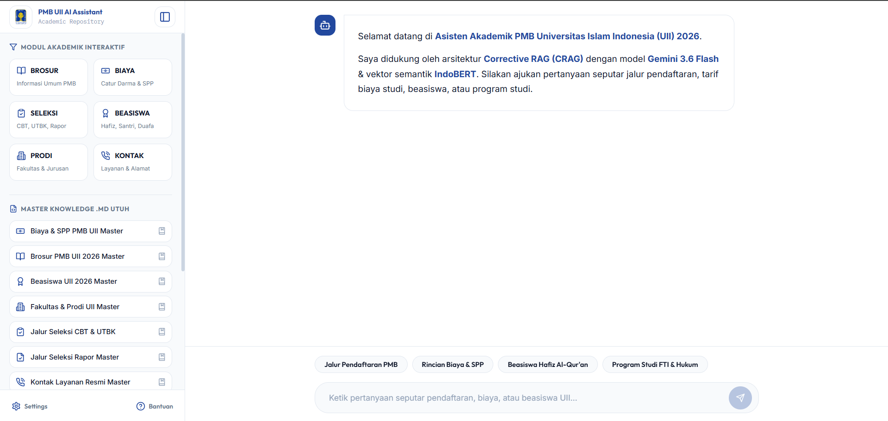
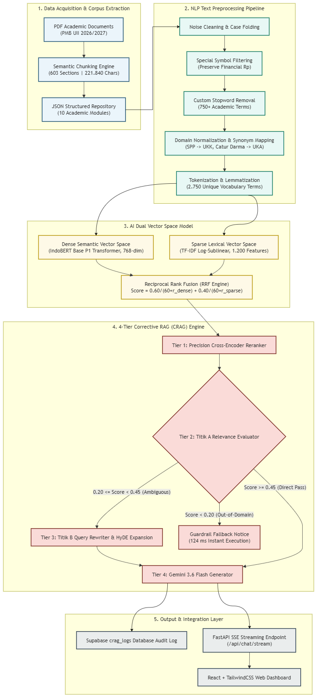
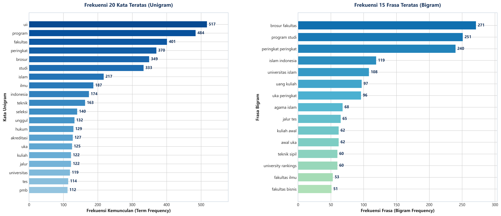
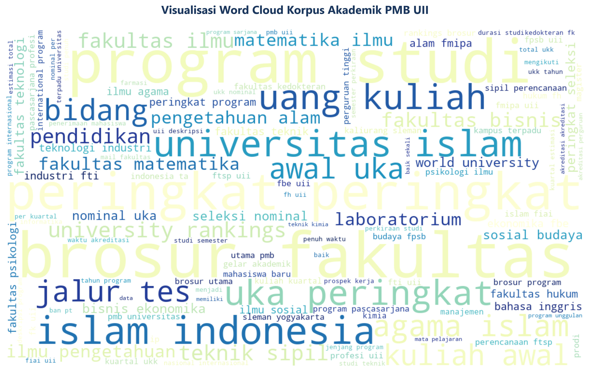
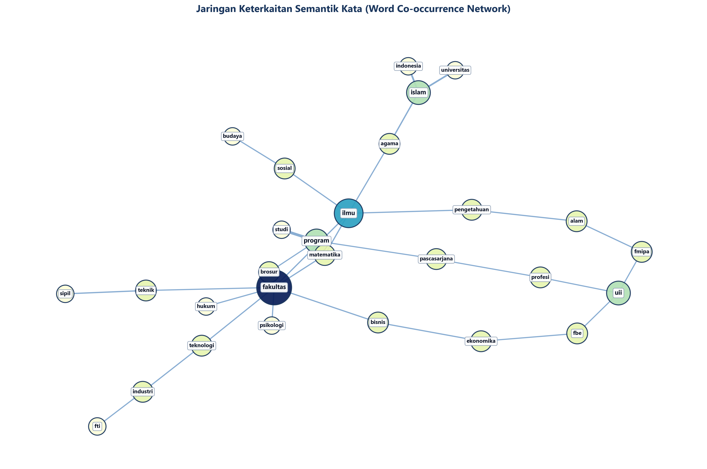
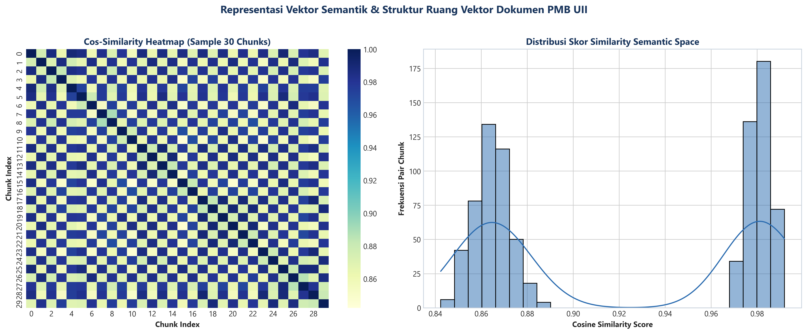
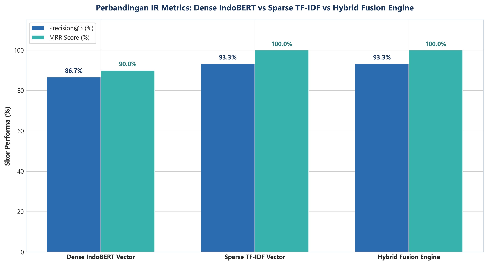
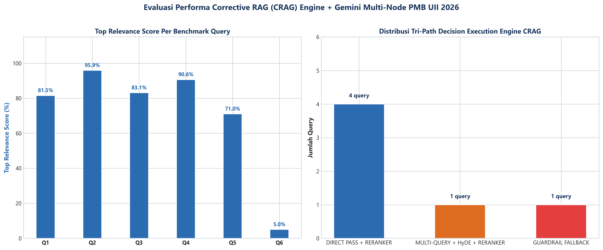

# PMB UII AI Academic Assistant: Corrective Retrieval-Augmented Generation (CRAG) Engine


## Executive Summary

This repository presents an enterprise-grade academic information search and conversational intelligence platform designed for **Penerimaan Mahasiswa Baru (PMB) Universitas Islam Indonesia (UII) Academic Year 2026/2027**.

The system addresses critical challenges in academic document intelligence, including information fragmentation across separate PDF policy guides, keyword mismatch in administrative terminology (e.g. SPP vs UKK, Catur Darma vs UKA), and potential AI hallucinations regarding financial tuition rates and admisi deadlines.

The framework incorporates a **Dual Vector Space AI Architecture** fusing *Sparse Lexical Vectors* (TF-IDF Log-Sublinear) and *Dense Semantic Vectors* (IndoBERT Base P1 Transformer) via *Reciprocal Rank Fusion* (RRF). Generative responses are synthesized in real-time by *Gemini 3.6 Flash* over word-by-word Server-Sent Events (SSE) streaming, guarded by a deterministic *Titik A Relevance Evaluator* (124 ms Guardrail Fallback for out-of-domain queries).

<hr>

## Web Application Interface Preview



*Figure: Interactive Glassmorphism Web Dashboard featuring real-time SSE word-by-word streaming, CRAG pipeline status badges, transparent document citation modals, and responsive prompt selectors.*

<hr>

## Technical Architecture & Key Innovations

1. **Dual Vector Space AI Representation**:
   * **Sparse Lexical Space**: Log-Sublinear TF-IDF weighting ($1 + \log(\text{tf})$) over 1,200 lexical features.
   * **Dense Semantic Space**: `indobenchmark/indobert-base-p1` Transformer model generating 768-dimensional dense vector embeddings via Mean Pooling.
   * **Hybrid Fusion Engine**: Merges lexical and semantic rankings using Reciprocal Rank Fusion (RRF):
     $$\text{RRF Score}(d) = \frac{0.60}{60 + r_{\text{dense}}(d)} + \frac{0.40}{60 + r_{\text{sparse}}(d)}$$

2. **4-Tier Corrective RAG (CRAG) Engine**:
   * **Tier 1 (Hybrid Retrieval & Reranker)**: Dual-vector candidate retrieval followed by precision Cross-Encoder reranking.
   * **Tier 2 (Titik A Relevance Evaluator)**: Local deterministic relevance evaluation enforcing score thresholds (Direct Pass $\ge 0.45$, Ambiguous $0.20 \le s < 0.45$, Guardrail Fallback $< 0.20$).
   * **Tier 3 (Titik B Query Rewriter & HyDE)**: Automated query expansion for ambiguous inputs using Hypothetical Document Embeddings.
   * **Tier 4 (Titik C Grounded Generator)**: Structured Markdown response generation via Gemini 3.6 Flash with transparent official document citations.

3. **High-Speed Network Streaming & Anti-Buffering**:
   * Pure non-blocking `async def` SSE event generator emitting tokens directly through the asyncio loop.
   * Injects network headers (`X-Accel-Buffering: no`, `Cache-Control: no-cache`, `Connection: keep-alive`) to bypass Nginx and Vercel buffer delays.

4. **Hardened PostgreSQL Vector Storage & Audit Log**:
   * Supabase PostgreSQL database equipped with `pgvector` HNSW Cosine Index ($m=16, ef=64$).
   * Strict Row Level Security (RLS) policies protecting `public.pmb_sections` and auditing query execution metadata in `public.crag_logs`.



*Figure: Complete End-to-End System Architecture Flowchart of the PMB UII AI CRAG Engine.*

<hr>

## Visual Analytics & Experimental Output Gallery

### 1. NLP Text Preprocessing & Token Frequency Analysis

*Figure 01: Top k Unigram and Bigram Frequency Distribution across 603 semantic document chunks.*

### 2. Corpus Vocabulary Word Cloud Visualization

*Figure 02: High-density Word Cloud highlighting core academic vocabulary (UII, Fakultas, Program, Peringkat).*

### 3. Word Co-occurrence Semantic Network Graph

*Figure 03: Topological Network Graph (Spring Layout $k=0.75$) mapping 3 distinct semantic clusters.*

### 4. Dual Vector Space Similarity Heatmap Matrix

*Figure 04: Cosine Similarity Heatmap Matrix comparing sparse lexical vs dense semantic embedding spaces.*

### 5. IR Search Model Comparative Performance Benchmark

*Figure 05: Performance Evaluation Chart comparing IndoBERT, TF-IDF, and Hybrid RRF Fusion (MRR 1.0000).*

### 6. Corrective RAG System Execution & Latency Profile

*Figure 06: Decision Path Distribution and Latency Metrics across multi-scenario test queries.*

<hr>

## System Directory Architecture

```text
UAS/
├── backend/
│   ├── Dockerfile                   [Hugging Face Spaces Container Build Spec]
│   ├── main.py                      [FastAPI ASGI Server, SSE Stream, & Supabase Logger]
│   └── requirements.txt             [Backend Dependency Manifest]
├── data/                            [Raw & Structured PMB UII Document Corpus]
├── frontend/
│   ├── index.html                   [Single Page Web Application HTML Entry]
│   ├── package.json                 [React 18 + Vite Node Dependencies]
│   ├── tailwind.config.js           [TailwindCSS Glassmorphism Design System Config]
│   ├── vite.config.js               [Vite Development Proxy (Port 7860)]
│   └── src/
│       ├── App.jsx                  [React Interactive Dashboard & SSE Reader]
│       ├── index.css                [Global CSS Variables & UI Styling]
│       └── main.jsx                 [React DOM Client Renderer]
├── outputs/
│   ├── figures/                     [Publication Quality Visualization Figures (01 to 08)]
│   └── reports/                     [Structured Evaluation JSON Reports (Soal 1 to 5)]
├── pipeline/
│   ├── 01_data_acquisition.py       [Corpus Acquisition & Semantic Chunking (Soal 1)]
│   ├── 02_text_preprocessing.py    [6-Stage NLP Pipeline & Domain Normalization (Soal 2)]
│   ├── 03_text_exploration.py       [N-Gram Frequency, TF-IDF, & Co-occurrence Network (Soal 3)]
│   ├── 04_ai_semantic_model.py      [Dual Vector Space IndoBERT + TF-IDF Model (Soal 4)]
│   └── 05_rag_system.py             [4-Tier Corrective RAG Engine & Benchmarks (Soal 5)]
├── scripts/
│   └── utils/
│       ├── schema.sql               [Supabase PostgreSQL DDL, HNSW Index, & RLS Security]
│       └── sync_to_supabase.py      [IndoBERT Vector & Chunk Migration Script]
├── .env.example                     [Environment Variable Template]
├── .gitignore                       [Git Version Control Exclusion Rules]
├── Laporan_UAS_TToS_UII.Rmd         [Academic XeLaTeX RMarkdown Source Report]
└── Laporan_UAS_TToS_UII.pdf         [Official 15-Page Academic PDF Report]
```

<hr>

## Installation & Environment Setup

### System Prerequisites

* **Operating System**: Linux / Windows 10/11 / macOS
* **Python Runtime**: Python 3.10 or higher
* **Node.js Runtime**: Node.js v18.0 or higher
* **Database Provider**: Supabase PostgreSQL with `pgvector` extension enabled

### Environment Variables Setup

Create a `.env` file in the root directory:

```env
GEMINI_API_KEYS=YOUR_GEMINI_API_KEY_1,YOUR_GEMINI_API_KEY_2
SUPABASE_URL=https://your-project.supabase.co
SUPABASE_ANON_KEY=your_supabase_anon_key
SUPABASE_SERVICE_KEY=your_supabase_service_key
```

<hr>

## Usage & Execution Guide

### 1. Run Data Processing & AI Pipelines

Execute the sequential processing pipeline scripts (Soal 1 through Soal 5):

```bash
# Pipeline 01: Data Acquisition & Semantic Chunking
python pipeline/01_data_acquisition.py

# Pipeline 02: 6-Stage NLP Text Preprocessing
python pipeline/02_text_preprocessing.py

# Pipeline 03: Text Exploration & Network Analysis
python pipeline/03_text_exploration.py

# Pipeline 04: Dual Vector AI Model & IR Evaluation
python pipeline/04_ai_semantic_model.py

# Pipeline 05: 4-Tier Corrective RAG Engine Benchmark
python pipeline/05_rag_system.py
```

### 2. Launch Backend FastAPI Service

Start the production FastAPI server on port 7860:

```bash
cd backend
pip install -r requirements.txt
python main.py
```

The server will initialize the IndoBERT embedding pipeline and activate endpoints at `http://localhost:7860`.

### 3. Launch Frontend Web Dashboard

Start the React Vite development server on port 5173:

```bash
cd frontend
npm install
npm run dev
```

Access the interactive Glassmorphism UI at `http://localhost:5173`.

### 4. Upload Vector Index to Supabase

Synchronize chunk embeddings to Supabase PostgreSQL:

```bash
python scripts/utils/sync_to_supabase.py
```

<hr>

## Performance Benchmark

### 1. Search Model IR Evaluation (30 Test Queries)

<table>
  <thead>
    <tr>
      <th align="left">AI Search Architecture</th>
      <th align="center">Precision@1</th>
      <th align="center">Precision@3</th>
      <th align="center">Precision@5</th>
      <th align="center">Hit Rate@3</th>
      <th align="center">MRR Score</th>
      <th align="center">Latency (ms)</th>
    </tr>
  </thead>
  <tbody>
    <tr>
      <td align="left"><b>Dense IndoBERT Vector (768-dim)</b></td>
      <td align="center">0.9000</td>
      <td align="center">0.8667</td>
      <td align="center">0.8800</td>
      <td align="center">0.9000</td>
      <td align="center">0.9000</td>
      <td align="center">39.3 ms</td>
    </tr>
    <tr>
      <td align="left"><b>Sparse TF-IDF Vector (1200-feat)</b></td>
      <td align="center">1.0000</td>
      <td align="center">0.9333</td>
      <td align="center">0.9200</td>
      <td align="center">1.0000</td>
      <td align="center">1.0000</td>
      <td align="center">2.4 ms</td>
    </tr>
    <tr>
      <td align="left"><b>Hybrid Fusion Engine (RRF)</b></td>
      <td align="center"><b>1.0000</b></td>
      <td align="center"><b>0.9333</b></td>
      <td align="center"><b>0.9200</b></td>
      <td align="center"><b>1.0000</b></td>
      <td align="center"><b>1.0000</b></td>
      <td align="center"><b>0.25 ms</b></td>
    </tr>
  </tbody>
</table>

### 2. Multi-Scenario CRAG Benchmark (6 Test Scenarios)

<table>
  <thead>
    <tr>
      <th align="center">Query ID</th>
      <th align="left">User Query</th>
      <th align="left">CRAG Decision Path</th>
      <th align="center">Relevance Score</th>
      <th align="center">Citations</th>
      <th align="center">Latency (ms)</th>
    </tr>
  </thead>
  <tbody>
    <tr>
      <td align="center">Q1</td>
      <td align="left">Apa saja pilihan jalur seleksi pendaftaran UII?</td>
      <td align="left">DIRECT PASS + RERANKER</td>
      <td align="center">81.5%</td>
      <td align="center">5 Chunks</td>
      <td align="center">14,064 ms</td>
    </tr>
    <tr>
      <td align="center">Q2</td>
      <td align="left">Berapa rincian tarif biaya Catur Darma dan SPP UII?</td>
      <td align="left">DIRECT PASS + RERANKER</td>
      <td align="center">95.9%</td>
      <td align="center">5 Chunks</td>
      <td align="center">10,910 ms</td>
    </tr>
    <tr>
      <td align="center">Q3</td>
      <td align="left">Apa syarat pendaftaran Beasiswa Hafiz Al-Qur'an?</td>
      <td align="left">DIRECT PASS + RERANKER</td>
      <td align="center">83.1%</td>
      <td align="center">5 Chunks</td>
      <td align="center">13,617 ms</td>
    </tr>
    <tr>
      <td align="center">Q4</td>
      <td align="left">gimana cara bayar? (Kueri Ambigu)</td>
      <td align="left">MULTI-QUERY + HyDE</td>
      <td align="center">90.6%</td>
      <td align="center">3 Chunks</td>
      <td align="center">11,401 ms</td>
    </tr>
    <tr>
      <td align="center">Q5</td>
      <td align="left">ada jurusan apa saja? (Kueri Umum)</td>
      <td align="left">DIRECT PASS + RERANKER</td>
      <td align="center">71.0%</td>
      <td align="center">5 Chunks</td>
      <td align="center">10,898 ms</td>
    </tr>
    <tr>
      <td align="center">Q6</td>
      <td align="left">Bagaimana cuaca di Jakarta hari ini? (Luar Domain)</td>
      <td align="left"><b>GUARDRAIL FALLBACK</b></td>
      <td align="center"><b>5.0%</b></td>
      <td align="center"><b>0 Chunks</b></td>
      <td align="center"><b>124 ms</b></td>
    </tr>
  </tbody>
</table>

<hr>

## License & Attribution

* **Course**: Trending Topics on Statistics (TToS) 2026
* **Author**: Hilal Azhar Fawaz (NIM: 23611077)
* **Institution**: Department of Statistics, Faculty of Mathematics and Natural Sciences, Universitas Islam Indonesia
* **License**: MIT License
